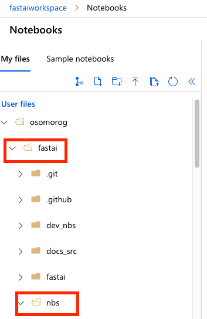

# Use FastAI with Azure Machine Learning!
This repository has examples showing you how to use FastAI on Azure ML.

# Create an ML workspace
The [Azure Machine Learning workspace](concept-workspace.md) is the top-level resource for the service. It provides you with a centralized place to work with all the artifacts you create. 

You can create an ML workspace by clicking here - **specify a unique resource group name for your Azure subscription!**:

[](https://portal.azure.com/#create/Microsoft.Template/uri/https%3A%2F%2Fraw.githubusercontent.com%2FAzure%2FAzureML-fastai%2Fmain%2F.cloud%2Fazuredeploy.json)

# Setup FastAI Environment
Go to the Azure ML studio (https://ml.azure.com) and find your ML workspace.

Open the terminal window in Azure ML studio:


Use the terminal window to create a new environment. For example, the code below creates fastaienv and activate the environment:
```shell
echo "y" | conda create --name fastaienv
conda activate fastaienv
```

Install fastai, nbdev, pip and ipykernel package to the new environment and create a kernel for that conda env:
```shell
echo "y" | conda install pip
echo "y" | conda install ipykernel
echo "y" | conda install -c fastai -c pytorch fastai
echo "y" | conda install -c fastai nbdev
```

Create a kernel for that conda env:
```shell
python -m ipykernel install --user --name fastaienv --display-name "Python (fastaienv)"
```

Clone the [Fast AI Repo](https://github.com/fastai/fastai) with below snippet:
```shell
git clone https://github.com/fastai/fastai.git
```

All of the notebook samples should now be cloned into the fastai folder and ready to run!

Refresh File Explorer to see all new files.


# Running FastAI Notebooks
1) Open a notebook in `fastai/nbs` you just cloned

2) Select the `Python (fastaienv)` Kernel

3) Run all cells in Notebook


# Contributing

This project welcomes contributions and suggestions.  Most contributions require you to agree to a
Contributor License Agreement (CLA) declaring that you have the right to, and actually do, grant us
the rights to use your contribution. For details, visit https://cla.opensource.microsoft.com.

When you submit a pull request, a CLA bot will automatically determine whether you need to provide
a CLA and decorate the PR appropriately (e.g., status check, comment). Simply follow the instructions
provided by the bot. You will only need to do this once across all repos using our CLA.

This project has adopted the [Microsoft Open Source Code of Conduct](https://opensource.microsoft.com/codeofconduct/).
For more information see the [Code of Conduct FAQ](https://opensource.microsoft.com/codeofconduct/faq/) or
contact [opencode@microsoft.com](mailto:opencode@microsoft.com) with any additional questions or comments.
